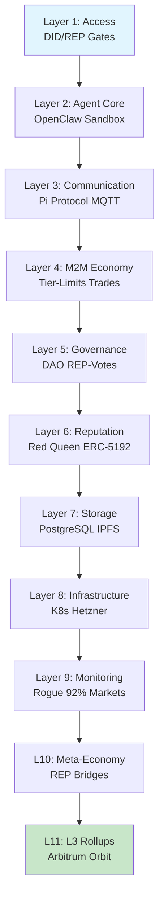

# Forge Framework V4 🛠️

**Universal, host-agnostic OS for scalable Human-AI collaboration.**  
From 3-5 founders to 100k agents across 100 projects. 11-Layer architecture with Red Queen REP (decay + boosts), shared REP staking, tiered access (0-3), M2M economy, ZK privacy, prediction markets & per-project L3 rollups.

## Layers Diagram


## Core Features

- **Layered Architecture**: 11 layers (Access, Agents, REP, Economy, Governance → L3).
- **Red Queen REP**: 5%/month decay, activity boosts vs. community avg.
- **Tier System**: REP → Tiers (0: Guest, 3: Root w/ killswitch).
- **M2M Economy**: Tier-limited trades (energy/compute/data).
- **Federated Multi-Project**: Cross-chain REP bridges, meta-governance.
- **Security**: Rogue detection (92% via markets), auto-pause, multisig.

| Tier | Min REP | Capabilities |
|------|---------|--------------|
| 0    | 0       | Read-only    |
| 1    | 10      | Basic agents |
| 2    | 100     | Vote, budget |
| 3    | 500     | Killswitch   | 

## Genesis-to-Production Lifecycle

End‑to‑end path from first node to multi-project, REP‑governed production network.

### Phase 0: Prepare Host & Team

1. **Choose Host & Domain**
   - Decide where Forge lives first: startup, DAO, city, research collective.
   - Pick initial domain profile (Research / Product / City / Hybrid) for REP parameters.

2. **Form Genesis Team**
   - 3–7 people with clear roles: Tech, Governance, Product, Security.
   - Define rough scope: 1–2 concrete use cases for the first 3–6 months.

---

### Phase 1: Infrastructure & Secrets

1. **Provision Core Infra**
   - Hetzner (or similar) nodes, Kubernetes/Docker.
   - PostgreSQL cluster, object storage (S3/MinIO), IPFS pinning.

2. **Network & Security**
   - VPN / WireGuard between nodes.
   - Secrets management (Vault, SOPS, Kubernetes Secrets).
   - Base observability: Prometheus, Loki, Grafana.

3. **Agent Runtime**
   - Deploy OpenClaw gateway & worker pools.
   - Register base tools (HTTP, DB, queue, file, chain).

```bash
# Example: bring up OpenClaw + Postgres locally
docker compose -f infra/docker-compose.dev.yml up -d
```

---

### Phase 2: Genesis Contracts & REP

1. **Deploy Genesis Agent** (≈500 LOC Python)
   - Mints core contracts on Optimism (or chosen L2):
     - ForgeDAO (governance)
     - ForgeREP (soulbound REP token)
     - Policy / Tier contracts (access, limits).

2. **Configure Domain Profile**
   - Set Decay‑Rate, Activity‑Booster, REP thresholds based on domain.
   - Store profile + rationale in `docs/governance/genesis-params.md`.

3. **Initial REP Distribution**
   - Seed REP for founders, early contributors, critical infrastructure.
   - Make distribution verifiable (scripted + on‑chain log).

```bash
pip install openclaw web3 psycopg2

# Deploys DAO/REP/Policy contracts and writes addresses to config/onchain.json
python backend/genesis/genesis-agent.py --network optimism
```

---

### Phase 3: Governance Bootstrap

1. **Create Governance Spaces**
   - Proposals: parameters, budgets, roles.
   - Emergency: kill‑switch, pause, incident response.
   - Meta: upgrades, new projects, L3 rollups.

2. **REP‑Weighted Voting Online**
   - Enable proposal/voting through Forge front‑end or CLI.
   - Require REP‑ and tier‑thresholds for proposals and veto.

3. **Founding Policies**
   - Approve:
     - Domain parameter profile (decay, booster, windows).
     - Security policies (who can pause, who can upgrade).
     - Budget envelopes for first agents and infra.

---

### Phase 4: Minimum Viable Agents (Pilot)

1. **Pick 1–2 Concrete Use Cases**
   - Example: Issue triage for OSS repo, marketing content pipeline, energy trading sandbox.

2. **Implement Core Agents**
   - 2–5 agents max:
     - Orchestrator / Router agent.
     - 1–2 domain agents (e.g. TriageAgent, MarketingAgent).
     - 1 risk / guardrail agent (killswitch, anomaly detection).

3. **Wire to M2M Economy (Sandbox)**
   - Internal credits or small on‑chain budgets with strict limits.
   - Log all agent‑to‑agent trades and decisions.

4. **Run Closed Pilot (4–8 Weeks)**
   - Only Tier‑1/2 users.
   - Daily feedback channel, weekly governance review.

---

### Phase 5: M2M Economy & Tiered Access

1. **Activate Tier System**
   - Map REP → tiers (0–3) in policy contract.
   - Gate:
     - Who can spawn agents.
     - Who can assign budgets.
     - Who can change policies.

2. **Turn On M2M Trades**
   - Define allowed resources: compute, data APIs, storage, energy, tokens.
   - Per‑tier limits: max spend per day/week, max counterparties, max risk.

3. **Introduce Prediction & Risk Markets (Optional)**
   - Add markets for:
     - “Will project X ship by date Y?”
     - “Will metric M hit threshold T?”
   - Use signals as inputs into REP boosts and budget decisions.

---

### Phase 6: Monitoring, Security & Red Queen Tuning

1. **Observability for Agents**
   - Metrics: call counts, latencies, error rates, cost per agent.
   - Logs: decisions, prompts, tool calls with minimal necessary data.

2. **Rogue Detection & Auto‑Pause**
   - Market‑ or rule‑based anomaly detection.
   - Auto‑pause for:
     - Budget overrun.
     - Policy violations.
     - Unusual call patterns.

3. **Red Queen REP Tuning**
   - Monitor:
     - REP distribution (Gini).
     - Median contribution interval.
     - Governance participation.
     - Churn rate.
   - Adjust decay/booster windows via governance if system feels too “fast” or “frozen”.

---

### Phase 7: Productionization of First Use Cases

1. **Harden Pilots**
   - Add tests, runbooks, on‑call for critical agents.
   - Move from testnet → L2 mainnet for economic flows.

2. **Formalize SLAs**
   - For agents providing critical services (billing, energy, risk).
   - Define uptime and failure modes.

3. **Open to Wider User Base**
   - Allow Tier‑0/1 users to interact with agents through UI or APIs.
   - Introduce REP earning for real‑world contributions.

---

### Phase 8: Multi-Project, L3 Rollups & Federation (V4)

1. **Add New Projects as Child Chains**
   - For each major domain (CRM, IoT, City, DeFi) spin up an L3 rollup.
   - Reuse governance + REP patterns.

2. **REP Bridges & Meta‑Economy**
   - Allow cross‑project REP transfers with discounts / caps.
   - Create Layer‑10 meta‑markets for shared resources and risk.

3. **Federated Governance**
   - Meta‑DAO for policies that span all projects (security, shared infra, brand).
   - Per‑project DAOs keep autonomy inside guardrails.

---

### Phase 9: Continuous Improvement & Retirement

1. **Lifecycle Governance**
   - Design → Pilot → Production → Sunset for agents and policies.
   - Require sunset plans for high‑risk agents.

2. **Regular Parameter Reviews**
   - Every 3–6 months:
     - Review decay/booster, tier‑thresholds, budget defaults.
     - Run simulations with updated patterns.

3. **Refactor & Decommission**
   - Merge duplicate agents.
   - Decommission obsolete ones with on‑chain archive of their history.

---

## Tech Stack

- **Agents**: OpenClaw (multi-agent runtime).
- **Blockchain**: Optimism L2, Arbitrum Orbit L3.
- **Contracts**: Solidity (ForgeREP.sol, MetaBridge.sol).
- **Backend**: Python/FastAPI, PostgreSQL.
- **Monitoring**: Prometheus + Market Signals.

## Docs
**Main**
- [V4 Full EN](docs/en%20/forge-v4-full-en.md) (Multi-Project)
- [V3.3 Full EN](docs/en%20/forge-v3.3-full-en.md) (Optional Layers)
- [V3.2 Full EN](docs/en%20/forge-v3.2-full-en.md) (Universal Framework)

**Other**

- [Deployment Examples](docs/en%20/deployment.md)
- [Socio-Technical Parameters (V3)](docs/en%20/forge-v3-socio-technical-parameters.md)

[](LICENSE)  
[](https://github.com/tkdev-forge/forge/stargazers)

**Keywords**: ai-agents, dao, rep, m2m, l3-rollup, openclaw
```
