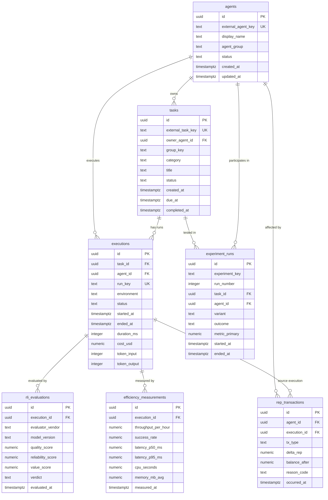

# Database Schema (Analytics + Execution)

## Scope
This document defines the canonical PostgreSQL schema for:

- `agents`
- `tasks`
- `executions`
- `rli_evaluations`
- `efficiency_measurements`
- `rep_transactions`
- `experiment_runs`

It is optimized for operational writes plus analytical queries by:

- time windows,
- agent,
- group,
- task category.

---

## ERD



---

## Column-level schema definition

### 1) `agents`

| Column | Type | Constraints | Notes |
|---|---|---|---|
| `id` | `uuid` | `PRIMARY KEY DEFAULT gen_random_uuid()` | Surrogate key |
| `external_agent_key` | `text` | `NOT NULL UNIQUE` | Stable app-level identifier |
| `display_name` | `text` | `NOT NULL` | Human-readable label |
| `agent_group` | `text` | `NOT NULL` | Team/cluster for aggregation |
| `status` | `text` | `NOT NULL DEFAULT 'active' CHECK (status IN ('active','paused','retired','blocked'))` | Lifecycle state |
| `created_at` | `timestamptz` | `NOT NULL DEFAULT now()` | Create timestamp |
| `updated_at` | `timestamptz` | `NOT NULL DEFAULT now()` | Last update timestamp |

### 2) `tasks`

| Column | Type | Constraints | Notes |
|---|---|---|---|
| `id` | `uuid` | `PRIMARY KEY DEFAULT gen_random_uuid()` | Surrogate key |
| `external_task_key` | `text` | `NOT NULL UNIQUE` | Idempotent ingestion key |
| `owner_agent_id` | `uuid` | `NOT NULL REFERENCES agents(id) ON DELETE RESTRICT` | Original owner |
| `group_key` | `text` | `NOT NULL` | Group dimension for analytics |
| `category` | `text` | `NOT NULL` | Category dimension |
| `title` | `text` | `NOT NULL` | Task title |
| `status` | `text` | `NOT NULL DEFAULT 'queued' CHECK (status IN ('queued','running','completed','failed','canceled'))` | Task state |
| `created_at` | `timestamptz` | `NOT NULL DEFAULT now()` | Task creation |
| `due_at` | `timestamptz` | `NULL` | Optional due date |
| `completed_at` | `timestamptz` | `NULL CHECK (completed_at IS NULL OR completed_at >= created_at)` | Completion timestamp |

### 3) `executions`

| Column | Type | Constraints | Notes |
|---|---|---|---|
| `id` | `uuid` | `PRIMARY KEY DEFAULT gen_random_uuid()` | Surrogate key |
| `task_id` | `uuid` | `NOT NULL REFERENCES tasks(id) ON DELETE CASCADE` | Parent task |
| `agent_id` | `uuid` | `NOT NULL REFERENCES agents(id) ON DELETE RESTRICT` | Running agent |
| `run_key` | `text` | `NOT NULL UNIQUE` | External run id |
| `environment` | `text` | `NOT NULL DEFAULT 'prod' CHECK (environment IN ('dev','staging','prod'))` | Runtime environment |
| `status` | `text` | `NOT NULL CHECK (status IN ('running','succeeded','failed','timeout','canceled'))` | Execution status |
| `started_at` | `timestamptz` | `NOT NULL` | Start time |
| `ended_at` | `timestamptz` | `NULL CHECK (ended_at IS NULL OR ended_at >= started_at)` | End time |
| `duration_ms` | `integer` | `NULL CHECK (duration_ms IS NULL OR duration_ms >= 0)` | Wall-clock duration |
| `cost_usd` | `numeric(12,4)` | `NOT NULL DEFAULT 0 CHECK (cost_usd >= 0)` | Cost in USD |
| `token_input` | `integer` | `NOT NULL DEFAULT 0 CHECK (token_input >= 0)` | Input tokens |
| `token_output` | `integer` | `NOT NULL DEFAULT 0 CHECK (token_output >= 0)` | Output tokens |

### 4) `rli_evaluations`

| Column | Type | Constraints | Notes |
|---|---|---|---|
| `id` | `uuid` | `PRIMARY KEY DEFAULT gen_random_uuid()` | Surrogate key |
| `execution_id` | `uuid` | `NOT NULL REFERENCES executions(id) ON DELETE CASCADE` | Evaluated execution |
| `evaluator_vendor` | `text` | `NOT NULL` | Provider name |
| `model_version` | `text` | `NOT NULL` | Evaluation model/version |
| `quality_score` | `numeric(6,3)` | `NOT NULL CHECK (quality_score >= 0 AND quality_score <= 100)` | Quality score |
| `reliability_score` | `numeric(6,3)` | `NOT NULL CHECK (reliability_score >= 0 AND reliability_score <= 100)` | Reliability score |
| `value_score` | `numeric(6,3)` | `NOT NULL CHECK (value_score >= 0 AND value_score <= 100)` | Value score |
| `verdict` | `text` | `NOT NULL CHECK (verdict IN ('pass','borderline','fail'))` | Result bucket |
| `evaluated_at` | `timestamptz` | `NOT NULL DEFAULT now()` | Evaluation timestamp |

### 5) `efficiency_measurements`

| Column | Type | Constraints | Notes |
|---|---|---|---|
| `id` | `uuid` | `PRIMARY KEY DEFAULT gen_random_uuid()` | Surrogate key |
| `execution_id` | `uuid` | `NOT NULL REFERENCES executions(id) ON DELETE CASCADE` | Measured execution |
| `throughput_per_hour` | `numeric(12,3)` | `NOT NULL CHECK (throughput_per_hour >= 0)` | Output volume per hour |
| `success_rate` | `numeric(6,5)` | `NOT NULL CHECK (success_rate >= 0 AND success_rate <= 1)` | 0..1 fraction |
| `latency_p50_ms` | `numeric(12,3)` | `NOT NULL CHECK (latency_p50_ms >= 0)` | P50 latency |
| `latency_p95_ms` | `numeric(12,3)` | `NOT NULL CHECK (latency_p95_ms >= 0)` | P95 latency |
| `cpu_seconds` | `numeric(12,3)` | `NOT NULL CHECK (cpu_seconds >= 0)` | CPU consumption |
| `memory_mb_avg` | `numeric(12,3)` | `NOT NULL CHECK (memory_mb_avg >= 0)` | Avg memory |
| `measured_at` | `timestamptz` | `NOT NULL DEFAULT now()` | Measurement timestamp |

### 6) `rep_transactions`

| Column | Type | Constraints | Notes |
|---|---|---|---|
| `id` | `uuid` | `PRIMARY KEY DEFAULT gen_random_uuid()` | Surrogate key |
| `agent_id` | `uuid` | `NOT NULL REFERENCES agents(id) ON DELETE RESTRICT` | Account affected |
| `execution_id` | `uuid` | `NULL REFERENCES executions(id) ON DELETE SET NULL` | Optional source run |
| `tx_type` | `text` | `NOT NULL CHECK (tx_type IN ('award','penalty','adjustment','reversal'))` | Ledger transaction type |
| `delta_rep` | `numeric(18,6)` | `NOT NULL CHECK (delta_rep <> 0)` | Signed delta |
| `balance_after` | `numeric(18,6)` | `NOT NULL CHECK (balance_after >= 0)` | Post-tx balance |
| `reason_code` | `text` | `NOT NULL` | Normalized reason |
| `occurred_at` | `timestamptz` | `NOT NULL DEFAULT now()` | Event timestamp |

### 7) `experiment_runs`

| Column | Type | Constraints | Notes |
|---|---|---|---|
| `id` | `uuid` | `PRIMARY KEY DEFAULT gen_random_uuid()` | Surrogate key |
| `experiment_key` | `text` | `NOT NULL` | Logical experiment id |
| `run_number` | `integer` | `NOT NULL CHECK (run_number > 0)` | Monotonic within experiment |
| `task_id` | `uuid` | `NOT NULL REFERENCES tasks(id) ON DELETE CASCADE` | Task under experiment |
| `agent_id` | `uuid` | `NOT NULL REFERENCES agents(id) ON DELETE RESTRICT` | Agent in run |
| `variant` | `text` | `NOT NULL` | Variant/treatment label |
| `outcome` | `text` | `NOT NULL CHECK (outcome IN ('success','failure','inconclusive'))` | Run result |
| `metric_primary` | `numeric(12,4)` | `NULL` | Main KPI |
| `started_at` | `timestamptz` | `NOT NULL` | Start timestamp |
| `ended_at` | `timestamptz` | `NULL CHECK (ended_at IS NULL OR ended_at >= started_at)` | End timestamp |

**Additional uniqueness**

- `UNIQUE (experiment_key, run_number)` on `experiment_runs`.
- Optional dedupe on evaluations: `UNIQUE (execution_id, evaluator_vendor, model_version, evaluated_at)`.

---

## Index plan (for analytical workloads)

### Query families

1. **Time-window metrics** (hour/day/week) over `executions`, `rep_transactions`, `rli_evaluations`.
2. **Agent-level dashboards** (single agent, top-N agents).
3. **Group/category slices** using `tasks.group_key` and `tasks.category`.
4. **Experiment analysis** by `experiment_key`, `variant`, and time.

### Recommended indexes

```sql
-- executions
CREATE INDEX idx_executions_started_at ON executions (started_at DESC);
CREATE INDEX idx_executions_agent_started ON executions (agent_id, started_at DESC);
CREATE INDEX idx_executions_task_started ON executions (task_id, started_at DESC);
CREATE INDEX idx_executions_status_started ON executions (status, started_at DESC);

-- tasks (group/category drilldowns)
CREATE INDEX idx_tasks_group_created ON tasks (group_key, created_at DESC);
CREATE INDEX idx_tasks_category_created ON tasks (category, created_at DESC);
CREATE INDEX idx_tasks_owner_created ON tasks (owner_agent_id, created_at DESC);

-- rli_evaluations
CREATE INDEX idx_rli_eval_time ON rli_evaluations (evaluated_at DESC);
CREATE INDEX idx_rli_eval_execution_time ON rli_evaluations (execution_id, evaluated_at DESC);

-- efficiency_measurements
CREATE INDEX idx_eff_measured_time ON efficiency_measurements (measured_at DESC);
CREATE INDEX idx_eff_execution_time ON efficiency_measurements (execution_id, measured_at DESC);

-- rep ledger analytics
CREATE INDEX idx_rep_occurred_at ON rep_transactions (occurred_at DESC);
CREATE INDEX idx_rep_agent_occurred ON rep_transactions (agent_id, occurred_at DESC);
CREATE INDEX idx_rep_type_occurred ON rep_transactions (tx_type, occurred_at DESC);

-- experiments
CREATE INDEX idx_exp_key_started ON experiment_runs (experiment_key, started_at DESC);
CREATE INDEX idx_exp_variant_started ON experiment_runs (variant, started_at DESC);
CREATE INDEX idx_exp_agent_started ON experiment_runs (agent_id, started_at DESC);
```

### Optional advanced indexing

- For very large append-only tables (`executions`, `rep_transactions`), add **BRIN** indexes on timestamp columns in addition to B-tree.
- Consider monthly range partitioning by `started_at` / `occurred_at` once rows exceed ~100M.
- Add materialized views for rollups (daily KPI by group/category) with scheduled refresh.

---

## Migration workflow

### Tool choice
Use **dbmate** (simple SQL-first migration tool) with PostgreSQL.

Why:

- Works directly with raw SQL (fits existing repo style).
- Easy up/down migration pairing.
- Minimal operational overhead.

### Versioning convention

- Directory: `forge-framework/sql/migrations/`
- File pattern:
  - `YYYYMMDDHHMMSS__<short_description>.up.sql`
  - `YYYYMMDDHHMMSS__<short_description>.down.sql`
- One logical change per migration.
- Never edit applied migration files; add a new forward migration.

### Rollback approach

- Every `.up.sql` requires a corresponding `.down.sql`.
- Rollback is used for:
  - failed deployments before data backfill,
  - non-destructive index/schema changes.
- For destructive changes (column drops/type narrowing), use **expand-contract**:
  1. add new structure,
  2. dual-write/backfill,
  3. switch reads,
  4. remove old structure in later migration.

### Deployment gates

1. Run migrations in staging.
2. Validate schema diff and query plans (`EXPLAIN`).
3. Run smoke checks on write/read paths.
4. Promote to production during low-traffic window.

---

## Backup / recovery policy

### Targets

- **RPO**: 15 minutes max data loss.
- **RTO**: 60 minutes to restore service.

### Strategy

- Nightly full backup + WAL archiving / PITR enabled.
- Keep 30 days hot backups, 90 days cold storage.
- Encrypt backups at rest and in transit.
- Restore destination must use separate credentials/project from primary.

### Restore testing cadence

- **Weekly**: automated restore of latest backup to ephemeral environment + checksum/sanity query suite.
- **Monthly**: point-in-time restore drill (simulate operator error).
- **Quarterly**: game-day with production-like load replay and measured RTO report.

---

## Reconciliation with existing `forge-framework/sql/`

Current SQL files are mostly PoC-era schemas and should be treated as legacy baselines, not the canonical analytics schema above.

| Existing file | Current contents | Status vs. new schema |
|---|---|---|
| `forge-framework/sql/schema.sql` | `members`, legacy `agents`, `rep_history` | **Legacy**: overlaps `agents`; `rep_history` should be superseded by `rep_transactions`. |
| `forge-framework/sql/02-governance-economy.sql` | `proposals`, `trades`, `agent_budgets` | **Adjacent domain**: keep for governance/economy; no direct conflict with new analytics tables. |
| `forge-framework/sql/shadowrep.sql` | `shadow_signals` | **Legacy/experimental**: may be retained for feature flag path; not canonical for REP ledger. |
| `forge-framework/sql/zk-sessions.sql` | `zk_sessions` | **Orthogonal**: privacy/session feature; keep unchanged. |
| `forge-framework/sql/prediction-markets.sql` | prediction market tables | **Orthogonal**: keep unchanged. |

### Deprecation marking proposal

1. Move PoC DDL into `forge-framework/sql/legacy/` in a follow-up migration repo cleanup.
2. Keep compatibility views during transition:
   - `rep_history` -> view over `rep_transactions` (where possible).
3. Add `README.md` in `forge-framework/sql/` designating:
   - `migrations/` as source of truth,
   - `legacy/` as non-authoritative historical artifacts.
